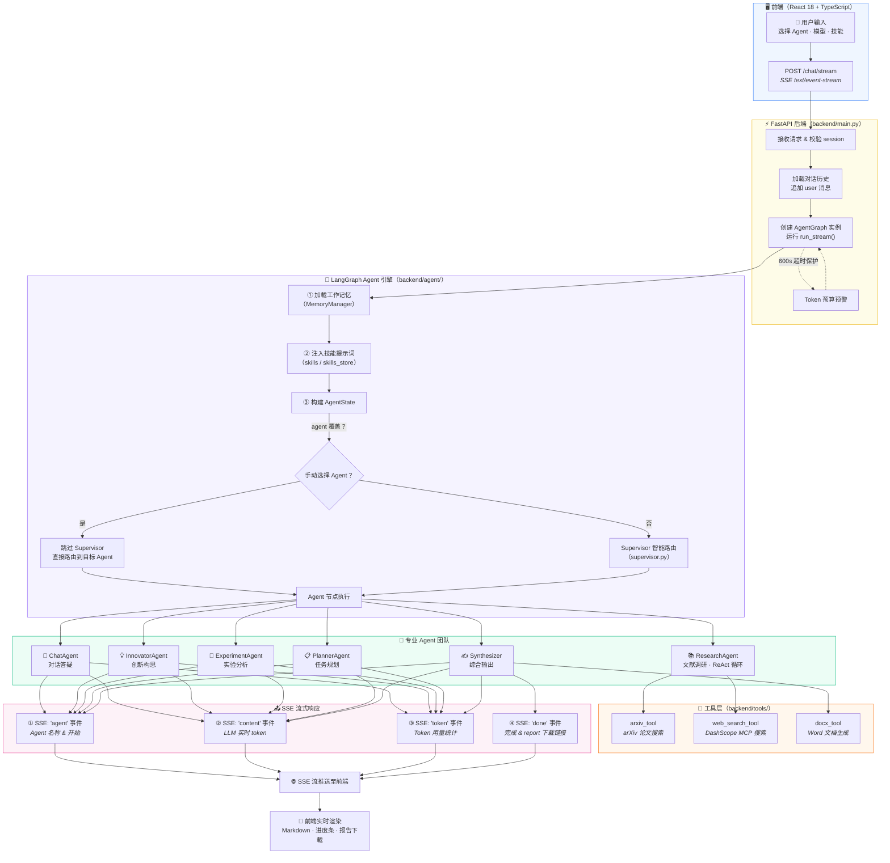
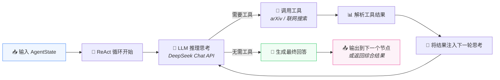
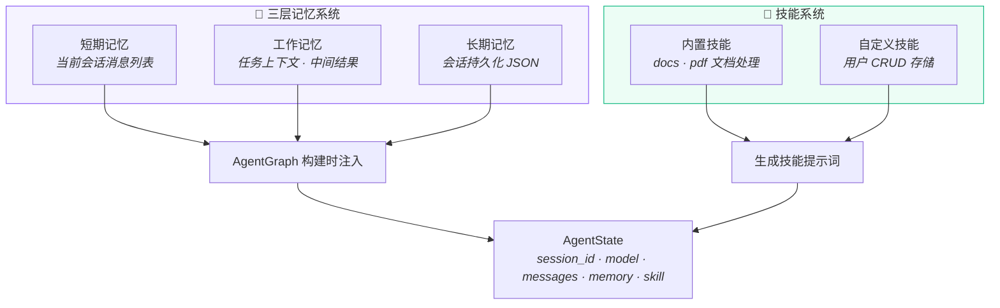

# 多 Agent 协作科研分析系统 - 整体流程示意图

## 总览：端到端数据流

## Agent 内部执行流程（ReAct 循环）

## 记忆系统 & 技能系统

## 图例

| 颜色 | 含义 |
|------|------|
| 🔵 蓝色 | 前端 React |
| 🟡 黄色 | FastAPI 后端 |
| 🟣 紫色 | LangGraph 引擎 / 记忆系统 |
| 🟢 绿色 | Agent 团队 / 技能系统 |
| 🟠 橙色 | 工具层 |
| 🩷 粉色 | SSE 流式输出 |
